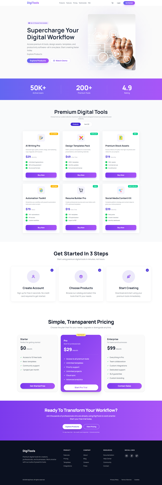

# DigiTools Platform

## Project overview

**DigiTools Platform** is a modern, responsive digital tools marketplace built with **React 19** and **Vite**. Users can browse premium digital products (AI tools, design templates, stock assets, and more), add items to a cart, and get a polished shopping-style experience. The UI uses a purple-forward gradient design, smooth interactions, and a layout that works well on mobile and desktop.

<p align="center">
  
</p>

---

## Tech stack

| Area | Technology |
|------|------------|
| UI | **React 19** |
| Build tool | **Vite 6** |
| Styling | **Tailwind CSS 4** (`@tailwindcss/vite`) |
| Component theming | **DaisyUI 5** |
| Icons | **lucide-react** |
| Notifications | **react-toastify** |
| Data | **JSON** (`src/data/products.json`) |
| Code quality | **ESLint 9** (with React Hooks & Refresh plugins) |

---

## Key features

1. **Hero & landing** — Headline, supporting copy, and primary CTAs (**Explore Products**, **Watch Demo**) with hero imagery.
2. **Sticky navbar** — Branding, navigation links, cart indicator with item count, **Login**, and **Get Started**.
3. **Stats strip** — Social-proof metrics (e.g. active users, tools, rating).
4. **Product catalog** — Responsive grid of product cards loaded from `products.json`, with pricing, tags, feature bullets, and add-to-cart actions.
5. **Smart cart** — Add items, remove line items, and clear the cart with checkout-style feedback via **react-toastify** toasts.
6. **Products / Cart toggle** — Switch between the product grid and cart view in the main section.
7. **How it works** — Three-step onboarding-style section (account, choose products, start creating).
8. **Pricing section** — Tiered plans (e.g. Starter, Pro, Enterprise) with feature lists.
9. **Footer CTA & footer** — Final call-to-action band plus multi-column footer with links and social placeholders.
10. **Performance** — Fast dev server and optimized production builds through Vite and React 19.

---

## Dependencies

### Production (`dependencies`)

| Package | Purpose |
|---------|---------|
| `react` | UI library |
| `react-dom` | DOM rendering |
| `lucide-react` | Icon set |
| `react-toastify` | Toast notifications |

### Development (`devDependencies`)

| Package | Purpose |
|---------|---------|
| `vite` | Dev server & production build |
| `@vitejs/plugin-react` | React support for Vite |
| `tailwindcss` | Utility-first CSS |
| `@tailwindcss/vite` | Tailwind + Vite integration |
| `daisyui` | UI themes & components |
| `eslint`, `@eslint/js`, `globals` | Linting baseline |
| `eslint-plugin-react-hooks`, `eslint-plugin-react-refresh` | React-specific lint rules |
| `@types/react`, `@types/react-dom` | Type definitions for editor support |

Exact versions are listed in [`package.json`](./package.json).

---

## Run locally

### Prerequisites

- **Node.js** — LTS (e.g. 18.x or 20.x) recommended  
- **npm** (bundled with Node)

### Steps

1. Open the project directory:

   ```bash
   cd Assignment-06
   ```

2. Install dependencies:

   ```bash
   npm install
   ```

3. Start the development server:

   ```bash
   npm run dev
   ```

4. Open the app in your browser — usually **`http://localhost:5173`** (use the URL printed in the terminal).

### Other scripts

| Command | Description |
|---------|-------------|
| `npm run build` | Production build to `dist/` |
| `npm run preview` | Preview the production build locally |
| `npm run lint` | Run ESLint |

---

## Live & related links

Update these with your deployment and repository URLs when available.

| Resource | Link |
|----------|------|
| **Live demo** | https://aquamarine-cassata-e283c5.netlify.app/ 

---

## License

This project is marked `"private": true` in `package.json` (typical for coursework or internal use). Add a root `LICENSE` file if you publish it publicly.
